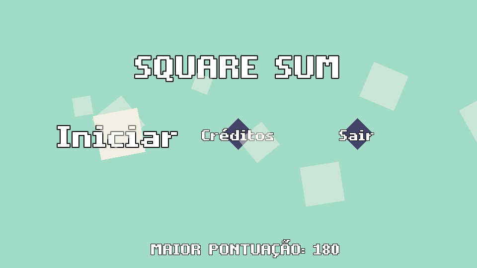

# 🔷 Square Sum 🔷

_Jogo de raciocínio lógico e matemático desenvolvido para a **Mostra Nacional de Robótica 2023** com foco em **Gameficação no Ensino Utilizando Sensores**._

🔶 **Square Sum** é um jogo que estimula o raciocínio rápido, testando sua habilidade de resolver cálculos dentro de um tempo determinado. O objetivo é girar a barra central para capturar dois números que, somados ao número da barra, resultem no valor alvo.

Originalmente concebido para uma experiência interativa através de um sensor de movimento em uma placa Arduino Esplora, o jogo agora oferece uma versão adaptada para suportar o controle pelo teclado e gamepad.

## 🎮 Como Jogar

- **Objetivo:** Gire a barra para selecionar dois números. A soma desses dois números com o número da barra deve ser igual ao resultado exibido no centro da tela.
- **Tempo:** Cada rodada tem um tempo limite! Acerte os cálculos para ganhar tempo extra e aumentar sua pontuação.
- **Combos:** Acerte em sequência para multiplicar seus pontos e entrar no modo _FEVER_!

## ⌨️ Controles

- **Setas / Analógico:** Movimentar a barra.
- **Enter / Botão A:** Confirmar a seleção.
- **Controle Esplora:** Incline o controle para girar a barra e pressione o botão para confirmar.

## 🛠️ Tecnologias Utilizadas

- **Engine:** Godot Engine
- **Linguagem:** GDScript
- **Hardware:** Integração com Arduino Esplora via comunicação serial para uma experiência de controle única com sensores.
- **Áudio:** As músicas foram criadas por _Level27_.

## 🚀 Como Executar o Projeto

### Pelo Editor Godot

1.  Certifique-se de ter o [Godot Engine](https://godotengine.org/) (versão 3.x) instalado.
2.  Clone este repositório: `git clone https://github.com/luisfpatrocinio/SquareSum.git`
3.  Abra o Godot, clique em "Importar" e selecione o arquivo `project.godot` na raiz do projeto.
4.  Pressione **F5** para executar o jogo.

### Versões Compiladas

O projeto já possui versões prontas para jogar nas pastas:

- `Build/Windows/`: Executável para Windows.
- `Build/`: Versão para navegador (HTML5). Basta abrir o arquivo `index.html`.

## 🧑‍💻 Desenvolvido por

- **Lívia Tainá Alves de Brito**
- **Luis Felipe dos Santos Patrocinio**
- **Ryan Faustino Carvalho**

## 🎵 Músicas

- **Stars Don't Twinkle** - _Level27_
- **The Club Entrance** - _Level27_
